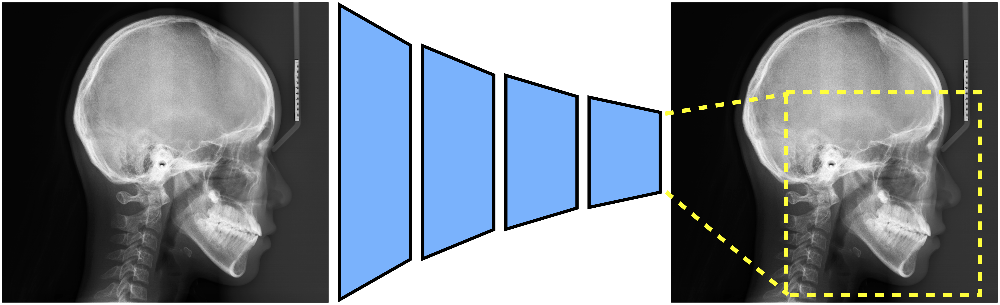
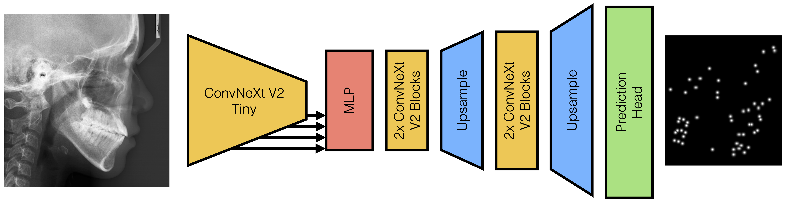

# Optimising for the Unknown

## MICCAI Cephalometric Landmark Detection Challenge

This repository contains the code for the paper "Optimising for the Unknown: Domain Alignment for Cephalometric Landmark Detection"

### Abstract
Cephalometric Landmark Detection is the process of identifying key areas for cephalometry. Each landmark is a single ground truth (GT) point labelled by a clinician.
A machine learning model predicts the probability locus of a landmark represented by a heatmap.
This work, for the 2024 CL-Detection MICCAI Challenge, proposes a domain alignment strategy with a regional facial extraction module and an X-ray artefact augmentation procedure.
The challenge ranks our method’s results as the best in mean radial error (MRE) of 1.186mm and third in the 2mm successful detection rate (SDR) of 82.04% on the online validation leaderboard.

### Architecture





### Qualitative Results


### Code Structure
The code is structured as follows:
 - ./dataset_utils contains the code for the dataset and data augmentation
 - ./models contains the code for the models
 - ./utils contains the code for the evaluation metrics
 - ./core contains the main code for the training and testing of the models
 - ./configs contains the configuration files for the experiments
 - ./trainers pytorch lightning modules for training and testing the models

### Installation
To install the required packages, run the following command:
```bash
pip install -r requirements.txt
```

### Training
To train the model, run the following command:
```bash
python core/train.py --config_path ./configs/config.yaml --saving_root_dir ./results
```

For testing; set the config file to RUN_TEST: True, RUN_TRAIN: False and run the same command.


### Configs 

Examples of the configuration files can be found in the configs folder.
To Test on a checkpointed model, update the TRAIN.CHECKPOINT_FILE attibute in the config file.
These can then be attached for ensembling with a list defined config header TRAIN.ENSEMBLE_MODEL_PATHS.
Ensembling is ran through the train_ensemble.py script with the same config file. 